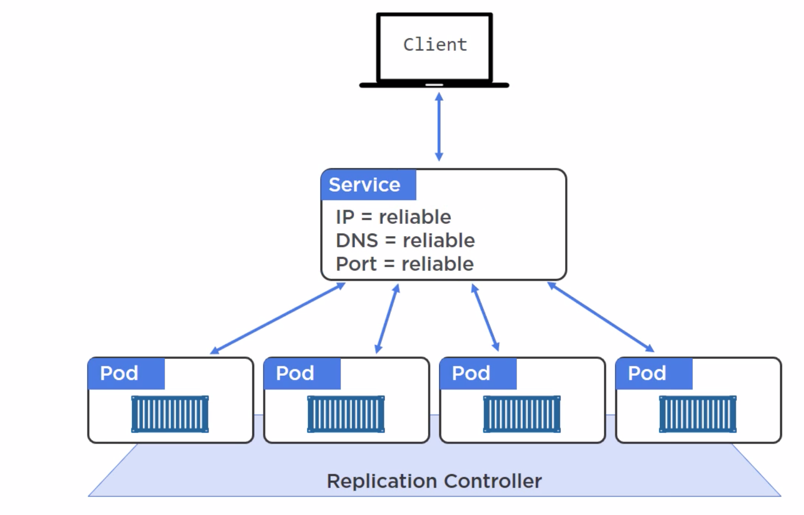
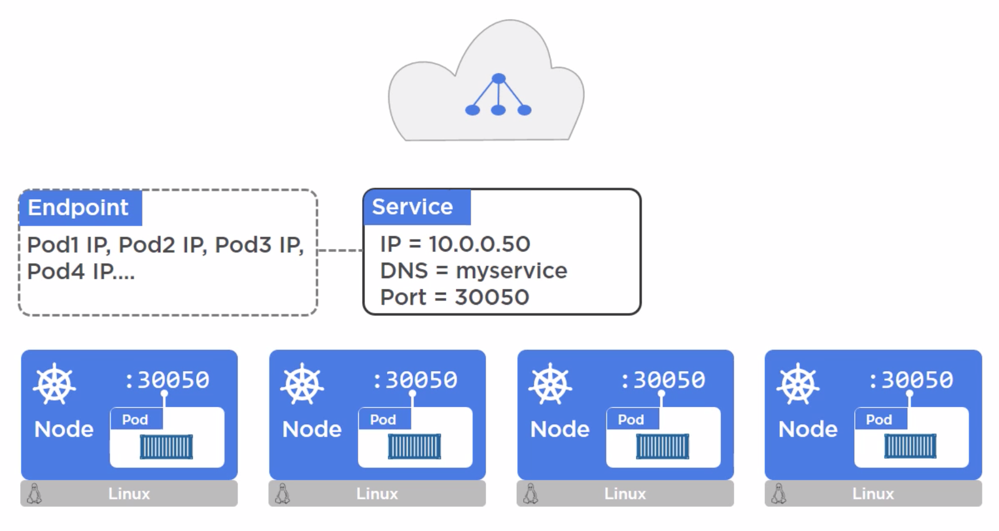
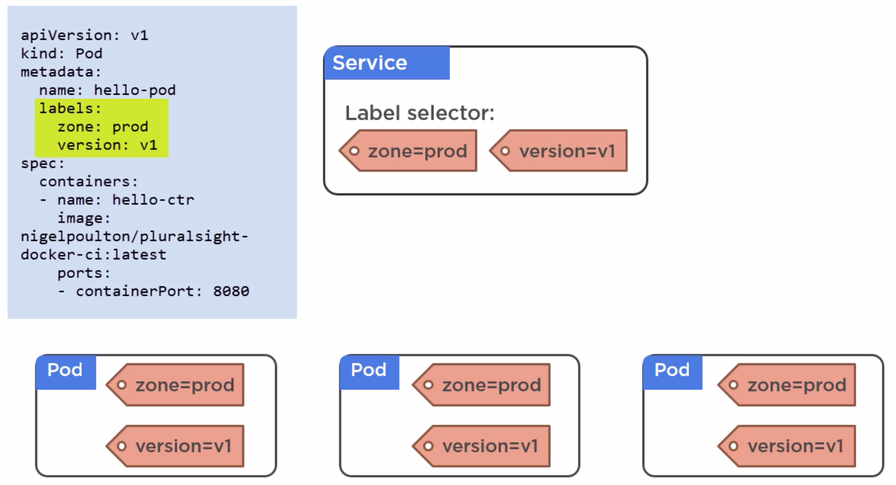

# Kubernetes Service Object
- Service is a REST object in the K8s API.
- It is abstraction
- It gets single IP, port and DNS and these never change.
- DNS name is same as service name
- Service sets bunch of networking modeling to enable outside access

- Anytime we create service, we also create `Endpoint`

## How do we access our app?
- From outside the cluster
- From inside the cluster
## Endpoint
- Endpoint holds all of the endpoints of pods
- As pods comes and go, list of endpoints keep getting update in `Endpoint`

- `Pods` are tied to Services/Endpoint using labels.
